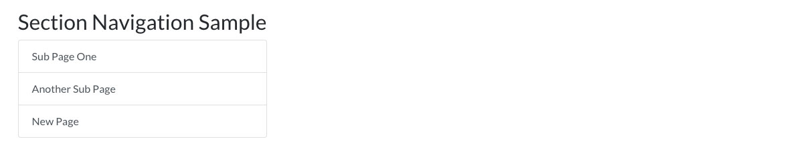

# Silverstripe Elemental Section Navigation

A block to display a list of links to child pages, or pages in current level.

## Requirements

* silverstripe/recipe-cms: ^1@dev || ^4@dev
* dnadesign/silverstripe-elemental: ^2@dev || ^3@dev

## Installation

`composer require dynamic/silverstripe-elemental-section-navigation`

## Example usage

Adds a block to display a list of links to child pages, or the pages in the current level. Useful for sidebar navigation.

### Template Notes

The default templates are based off [Bootstrap 4](https://getbootstrap.com/) classes/styling, specifically the [List Group](http://getbootstrap.com/docs/4.1/components/list-group/).

## Screen Shots

#### Front End sample of a Section Navigation Element

## Getting more elements

See [Elemental modules by Dynamic](https://github.com/dynamic/silverstripe-elemental-blocks#getting-more-elements)

## Configuration

See [SilverStripe Elemental Configuration](https://github.com/dnadesign/silverstripe-elemental#configuration)